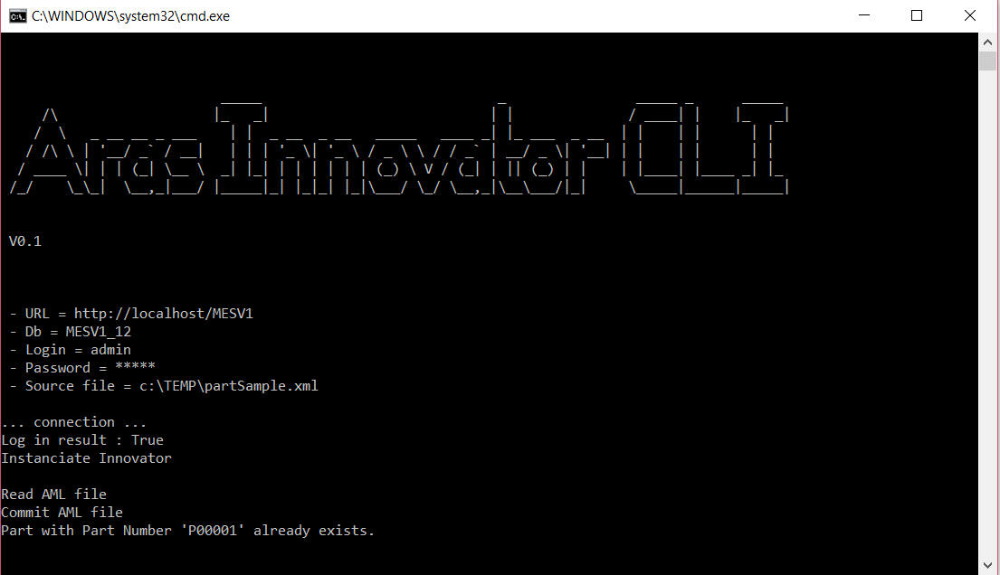

# aras-innovator-cli
Command Line Interface Sample Project for interacting with Aras

aras-innovator-cli is a sample visual studio project to demonstrate how you can build simple executables which can be used to automate processes.

**Built Using:** Aras 11.0 SP12

**Tested on** : 11SP12, 11SP15

**Before trying to build this project you need to reference the right version of IOM (the Aras Innovator API).**



## Usage

The sample application allows to send the AML content of a file to Aras Innovator. 

### Mandatory arguments

```
	-l  <url>           => Aras URL
    -d  <dbname>        => Aras Database
    -u  <user login>    => Aras User
    -p  <password>      => Aras Password
    -f  <filepath>      => Input AML File
```

### Optional arguments

```
	-o	<filepath>		=> output filepath
	-g 	<filepath>		=> output log filepath
	-rec 			   => defines if file upload search for files recursively
	-m <mode>			=> 'files' or 'aml' (default is 'aml')
	-fop 				=> required in file mode to designate the file folder
```


## Contributing

1. Fork it!
2. Create your feature branch: `git checkout -b my-new-feature`
3. Commit your changes: `git commit -am 'Add some feature'`
4. Push to the branch: `git push origin my-new-feature`
5. Submit a pull request

For more information on contributing to this project, another Aras Labs project, or any Aras Community project, shoot us an email at [araslabs@aras.com](mailto:araslabs@aras.com).

## Credits

Project written, documented, and published by Yoann Maingon at Aras Labs. @YoannArasLab

## License

Aras Labs projects are published to Github under the MIT license. See the [LICENSE file](https://github.com/ArasLabs/toc-search-bar/blob/master/LICENSE.md) for license rights and limitations.